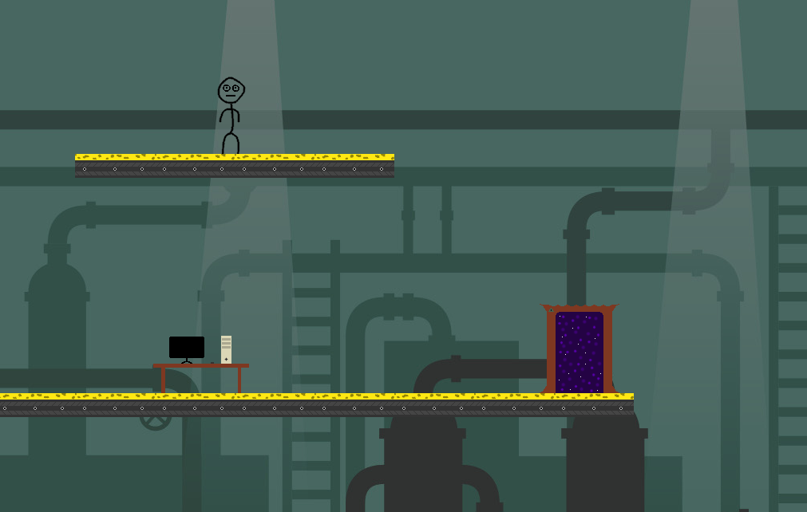
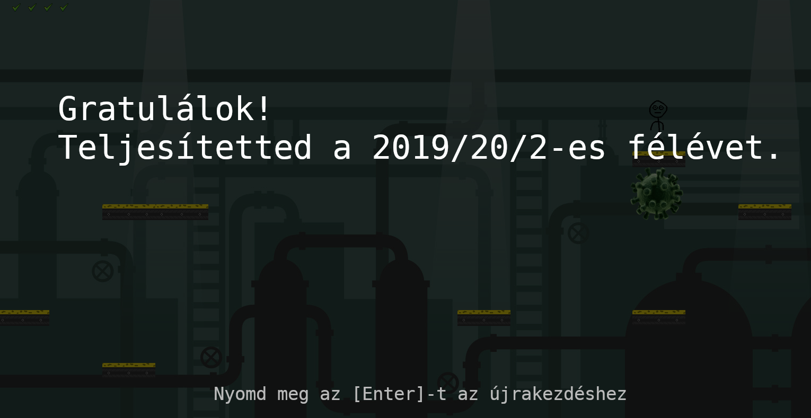

# Impossible Mission JAVA Remake

ELTE-IK Szoftvertechnológia gyakorlatának beadandó feladata

- [Impossible Mission JAVA Remake](#impossible-mission-java-remake)
  - [Directory structure guide](#directory-structure-guide)
  - [Készítők](#k%c3%a9sz%c3%adt%c5%91k)
  - [A játék](#a-j%c3%a1t%c3%a9k)
  - [](#img-src%22screenshotsszemermes1png%22-width%22600px%22)

## Directory structure guide

```
A következő struktúrájú mappaszerkezetet
kell létrehozni a szerveren:

src
   model
      *.java
   view
      *.java
   controller
      *java
   images
      *.gif
      *.jpg
   sounds
      *.wav
doc
   SoftwareModel.eapx (Enterprise Architect modell)

Csak ilyen fájlokat szabad feltölteni:
.java, .gif, .jpg, .wav, .eapx
```

## Készítők

* Szabó Martin
* Leczó Gábor Bálint
* Simonyi Patrik

## A játék


--

